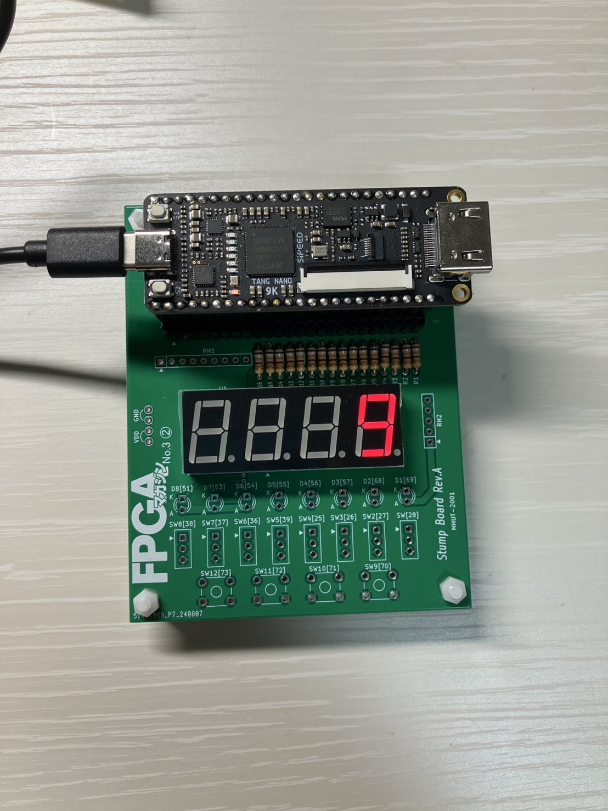
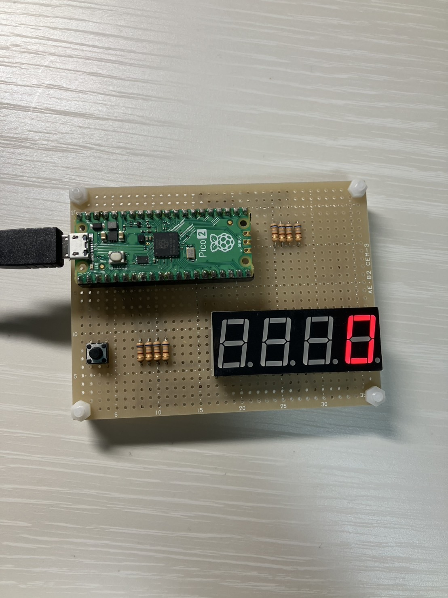

# 7seg

このプロジェクトは、新入生向けの体験講座として **Tang Nano 9K** と **Raspberry Pi Pico 2** を使用し、  
**カソードコモンの7セグメントLED** に 99 までカウントを表示するものです。  
現在、99 までのカウントが実装されており、今後もアップデートの可能性があります。

## ハードウェア構成
本プロジェクトでは、**Tang Nano 9K** は市販のTang Nano 9K学習用基板（[参考サイト](https://fpga.tokyo/mhut/)）を使用し、**Raspberry Pi Pico 2** は **自作の7セグメント接続基板** を用いて構成しています。

### Tang Nano 9K ピン配置
Tang Nano 9K のピン配置は、`7seg/tang_nano_9k` 内の **`.cst` ファイル** を参照してください。

### Raspberry Pi Pico 2 ピン配置

#### ボタン接続
| ピン | 接続先 |
|------|--------|
| GP0  | ボタン → GND |

#### 7セグメントLED接続
| ピン | 接続先 |
|------|--------|
| GP18 | 680Ω → A |
| GP20 | 680Ω → B |
| GP2  | 680Ω → C |
| GP4  | 680Ω → D |
| GP5  | 680Ω → E |
| GP19 | 680Ω → F |
| GP21 | 680Ω → G |
| GP3  | 680Ω → DP |

#### 桁制御（カソードコモン）
| ピン | 接続先 |
|------|--------|
| GP13 | 680Ω → D1 |
| GP12 | 680Ω → D2 |
| GP11 | 680Ω → D3 |
| GP10 | 680Ω → D4 |

## 実装内容とコード

### 7セグメントLEDに数字を表示
- **Verilog:** [`seven_seg.v`](7seg/tang_nano_9k/seven_seg.v)

実装した要素を以下に示します。

  

- **Python:** [`seven_seg.py`](7seg/raspberrypi_pico/seven_seg.py)

実装した要素を以下に示します。

  

### 0～9 までのカウント
- **Verilog:** [`count9.v`](7seg/tang_nano_9k/count9.v)

実装した様子を以下に示します。

- **Python:** [`count9.py`](7seg/raspberrypi_pico/count9.py)

実装した様子を以下に示します。

### 0～99 までのカウント
- **Verilog:** [`count99.v`](7seg/tang_nano_9k/count99.v)

実装した様子を以下に示します。

- **Python:** [`count99.py`](7seg/raspberrypi_pico/count99.py)

実装した様子を以下に示します。
